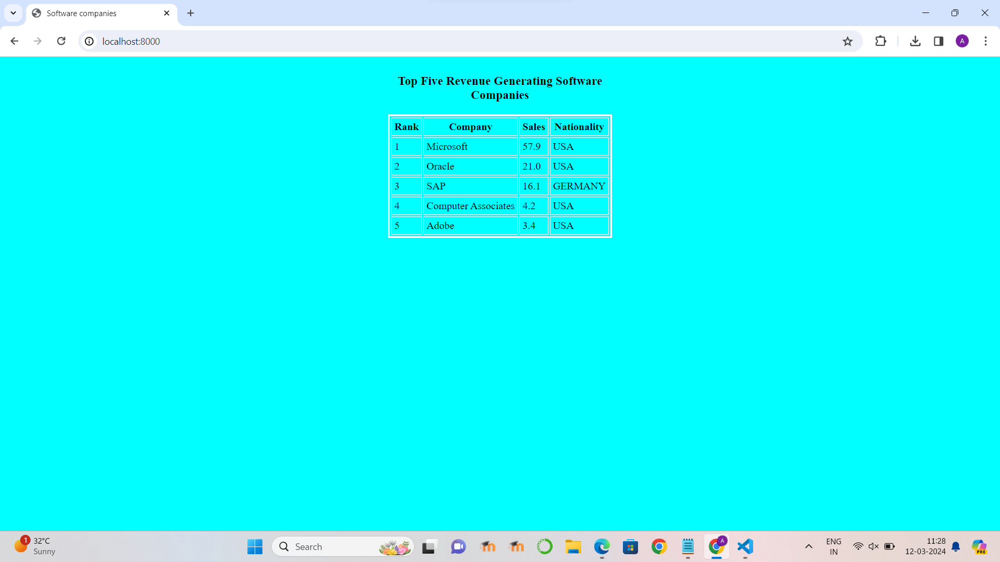

# EX01 Developing a Simple Webserver
## Date: 21-02-2024

## AIM:
To develop a simple webserver to serve html pages.

## DESIGN STEPS:
### Step 1: 
HTML content creation.

### Step 2:
Design of webserver workflow.

### Step 3:
Implementation using Python code.

### Step 4:
Serving the HTML pages.

### Step 5:
Testing the webserver.

## PROGRAM:
```
from http.server import HTTPServer, BaseHTTPRequestHandler
content="""
<html>
<head>
<title>Software companies</title>
</head>
<body bgcolor="aqua">
<table align="center" border="3" bordercolor="white" cellspacing="3" cellpadding="4">
<caption><h3>Top Five Revenue Generating Software Companies</h3></caption>
<tr>
<th>Rank</th>
<th>Company</th>
<th>Sales</th>
<th>Nationality</th>
</tr>
<tr>
<td>1</td>
<td>Microsoft</td>
<td>57.9</td>
<td>USA</td>
</tr>
<tr>
<td>2</td>
<td>Oracle</td>
<td>21.0</td>
<td>USA</td>
</tr>
<tr>
<td>3</td>
<td>SAP</td>
<td>16.1</td>
<td>GERMANY</td>
</tr>
<tr>
<td>4</td>
<td>Computer Associates</td>
<td>4.2</td>
<td>USA</td>
</tr>
<tr>
<td>5</td>
<td>Adobe</td>
<td>3.4</td>
<td>USA</td>
</tr>
</table>
</body>
</html>

"""
class myhandler(BaseHTTPRequestHandler):
    def do_GET(self):
        print("request received")
        self.send_response(200)
        self.send_header('content-type', 'text/html; charset=utf-8')
        self.end_headers()
        self.wfile.write(content.encode())
server_address = ('',8000)
httpd = HTTPServer(server_address,myhandler)
print("my webserver is running...")
httpd.serve_forever()
```
## OUTPUT:
.png)


## RESULT:
The program for implementing simple webserver is executed successfully.
